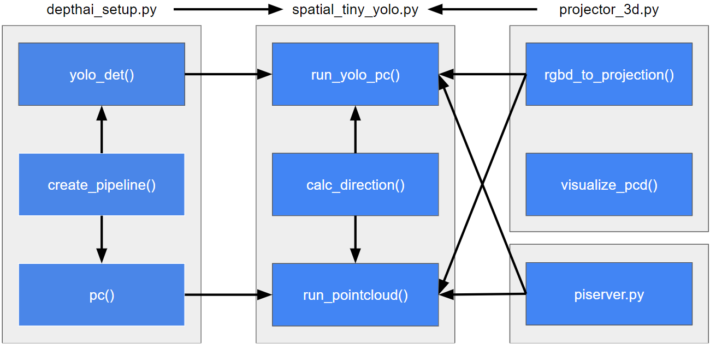

# Software Readme
## Module Overview
### Files
There are three files that contain all the logic necessary to accomplish the functions of our system.  
- [depthai_setup.py]() - contains the code needed to setup the pipelines to obtain rgb and depth data from the OAK-D as well as the detections from the model that is being used. 
- [spatial_tiny_yolo.py]() - contains the code needed to generate the pointcloud from the data obtained by the OAK-D and to determine whether an obstacle is present. It also contains the code needed to obtain the directions to the object of interest.
- [projector_3d.py]() - this file was obtained from the following [source](). It contains the code necessary to generate a pointcloud from rgb and depth data. It also contains a function to the visualize the pointcloud.
- [piserver.py]() - contains the code needed to host a server on the Pi Zero and receive data from the Pi 4 on whether an obstacle is present or not. It also contains code that causes the linear resonant actuator to vibrate. This file is run independently only on the Pi Zero.
#### Modules
##### depthai_setup.py
- DepthAi Class
  - [create_pipeline()](https://github.com/amg1998/BUSeniorDesign-Opticle-21-22/blob/tasks/examples/test/depthai_setup.py#:~:text=def-,create_pipeline,-(self%2C%20nnBlobPath)%3A) - this function is used to do all the necessary setup that is needed to obtain data streams from the OAK-D as well as run the neural network on the OAK-D. The required configuration options are set here, and there is an option to create a pipeline to run either a YOLO-based or MobileNet-based model.
  - [yolo_det()](https://github.com/amg1998/BUSeniorDesign-Opticle-21-22/blob/tasks/examples/test/depthai_setup.py#:~:text=def-,yolo_det,-(self)%3A) - this function contains the code that is used to obtain the streams of data from the OAK-D that are required when running both object detection with a Neural Network as well as obstacle detection with the pointcloud. From this function we obtain the rgb and depth frames used by the NN and to generate the pointcloud. This function also returns an array of detections corresponding to the given frame. Each entry in the detections array contains all detections found within one frame. Each detection contains the label, confidence value, and bounding box coordinates. 
  - [pc()](https://github.com/amg1998/BUSeniorDesign-Opticle-21-22/blob/tasks/examples/test/depthai_setup.py#:~:text=def-,pc,-(self)%3A) - this function is used to obtain streams of data from the OAK-D that are utilized when running obstacle detection with the pointcloud. From this function we obtain the rgb and depth streams utilized to generate the pointcloud.
##### spatial_tiny_yolo.py
- Main Class
  - [run_yolo_pc()]() - this function uses the rgb frames, depth frames, and detections obtained from the yolo_det() function to perform two main tasks. First, it uses the highest confidence detection in each frame that was obtained in the previous second to determine a median depth for the detected object. This is then used as the object of interest that the user is guided towards. An instruction with the distance and heading is communicated to the user the first time the object is detected, and then every time the distance to the object changes by a set threshold. This function also generates the pointcloud and determines whether the number of points present within a predetermined cuboid of space in front of the user is large enough to signify the presence of an obstacle.
  - [calc_direction()]() - this function calculates the heading that needs to be communicated to the user based on the x-axis and z-axis locations of the bounding box around the detected object. It returns the heading in a format that resembles a clock (eg. head towards 12 o'clock)
  - [run_pointcloud()]() - this function uses the rgb frames and depth frames to generate the pointcloud. It then determines whether the number of points present within a predetermined cuboid of space in front of the user is large enough to signify the presence of an obstacle.
##### projector_3d.py
- PointCloudVisualizer Class
  - [rgbd_to_projection()]() - this function generates a pointcloud frame by using a depth and rgb frame. It uses the open3d library to accomplish this.
  - [visualize_pcd()]() - this function uses the open3d library to visualize the pointcloud frames that are generated.


## Flow Chart


## Dev/Build Tool Information
```
python==3.8.8
depthai==2.15.1.0
gTTS==2.2.4
numpy==1.22.3
open3d==0.10.0.0
opencv-python==4.5.1.48
mpg123
```

## Installation
Install the requirements by running the following command:
```
python -m pip install -r requirements.txt
sudo apt-get install mpg123
```
Run the program by running:
```
python spatial_tiny_yolo.py
```
